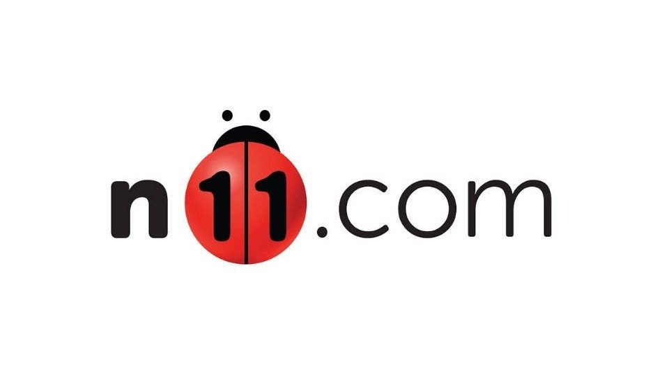

# <h1 align="center">  Micro Grup Task

---

* http://www.n11.com sitesine gidilerek, anasayfanın açıldığı onaylanacak,
* Login ekranı açılarak, bir kullanıcı ile login olunacak,
* Ekranın üstündeki --search-- alanına "IPhone" kelimesi yazılarak arama yapılacak, 
* Gelen sayfada "IPhone" için sonuç bulundugunu onaylanacak, 
* Arama sonuçlarından 2. sayfaya tıklanacak ve açılan sayfada 2. sayfanin şuan gösterimde olduğu onaylanacak,
* 3. ürün 'favorilere' eklenecek, 
* Ekranin en üstündeki 'favorilerim' linkine tıklanacak, 
* Acilan sayfada bir önceki sayfada izlemeye alinmis ürünün bulunduğu onaylanacak,
* Favorilere alınan bu ürünün yanındaki 'Kaldır' butonuna basarak, favorilerimden çıkarılacak,
* Sayfada bu ürünün artık favorilerde olmadığı onaylanacaktır,
* Siteden logout yapılarak çıkış sağlanacak.

* Tüm bu adımların ekran görüntüsü rapora eklenecektir.

---

# <h2 align="center"> API Testi İçin 

* Test klasörü altında bulunun TestApi isimli dosya açılır ve TestApi isimli test çalıştırılır. Testler pozitif ve negatif senaryo içermektedir. (CRUD)
      
      * Kullanıcı oluştur (Pozitif),
      * Kullanıcı oluştur (Negatif),
      * Oluşturulan kullancı bilgilerini Update et(Pozitif),
      * Oluşturulan kullancı bilgilerini Update edememe(Negatif),
      * Oluşturulan kullanıcıyı bulma (Pozitif),
      * Oluşturulan kullanıcıyı bulamama (Negatif),
      * Kullanıcı silme (Pozitif),
      * Kullanıcı silememe (Negatif),
      
 * <h3> Not : Testlerin bağımsız çalıştırılması hataya sebebiyet verebilir.     
      
-----

# <h2 align="center"> UI Testi İçin

* Test klasörü altında bulunan HomePageTest dosyası içerisinde bulunan "HomePageTest" veya "MicroGrupTest" metotları çalıştırılır.
* Test sonunda report.html dosyasından test sonuçlarına ulaşılabilir. (Lütfen Chrome Tarayıcısıyla açınız.)

